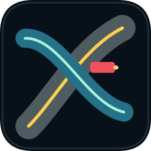

<p align="center">
  
</p>

<h1 align="center">SumoGUIMac</h1>

<p align="center">
  Native macOS SUMO GUI
</p>

A native macOS port of [Eclipse SUMO](https://eclipse.dev/sumo/)'s `sumo-gui` — SwiftUI + Metal, full TraCI connectivity, built to open normal SUMO `.sumocfg` workflows on macOS.

> **Status: pre-alpha.** The engine core builds and the native app can open `.sumocfg`, launch SUMO, step/play, render lanes/junctions/live vehicles in Metal, and inspect selected vehicles or edges. Track real progress in [`docs/CHECKLIST.md`](docs/CHECKLIST.md).

## Why

`sumo-gui` works with some severe visual issues and lacks a lot of the functionalities of a native mac app. It's a FOX-toolkit/OpenGL app that doesn't feel native on macOS. This is a from-scratch SwiftUI rewrite that talks to the same SUMO engine over TraCI, so any existing `.sumocfg` Just Works.

## Goals

- Functionally indistinguishable from `sumo-gui` for everyday use
- Smooth rendering for large real-world networks
- Native macOS HIG, dark mode, sandboxing-ready
- Open-source (MIT) and contributor-friendly

## Status snapshot

See [`docs/CHECKLIST.md`](docs/CHECKLIST.md) — single source of truth.

## Requirements

- macOS 14+, Xcode 15+ / Swift 5.9+
- A working Eclipse SUMO install (provides the `sumo` binary used over TraCI). `Scripts/find-sumo.sh` checks common Homebrew / `EclipseSUMO.framework` locations.
- The included `Examples/Tiny/tiny.sumocfg` is a small smoke scenario for local testing.

## Build & run

```sh
swift build
swift run SumoGUIMac
```

For a real macOS `.app` bundle with the app icon:

```sh
xcodebuild -project SumoGUIMac.xcodeproj -scheme SumoGUIMacApp -configuration Debug -destination platform=macOS build
```

To open a file on launch, more like `sumo-gui`:

```sh
swift run SumoGUIMac -- -c Examples/Tiny/tiny.sumocfg
# or
swift run SumoGUIMac -- Examples/Tiny/tiny.sumocfg
```

The example path is only a smoke-test input. The GUI is intended to open ordinary SUMO `.sumocfg` and `.net.xml` files, not a specific scenario.

To visualize an existing controller/MAPPO run, start SUMO externally with TraCI enabled and enough clients, then use **File > Attach to TraCI...** in the app:

```sh
sumo -c path/to/scenario.sumocfg --remote-port 8813 --num-clients 2
```

Your controller and SumoGUIMac should use different TraCI client orders. The app loads the matching `.sumocfg`/`.net.xml` for geometry, then attaches as a viewer client.

## Tests

```sh
swift test
```

Some tests round-trip against a live SUMO process; if `sumo` isn't on `PATH`, those skip.

## Map interaction

- Drag — pan
- Scroll (precise) — pan
- Cmd+scroll, Option+scroll, scroll wheel — zoom at cursor
- Two-finger pinch — zoom at cursor *(Apple trackpad only — Magic Mouse does not generate pinch events at the OS level)*
- Double-click — zoom in (Option+double-click — zoom out)
- `Cmd+=` / `Cmd+-` — zoom in / out
- `Cmd+0` — fit network to window
- `Space` — play / pause
- `s` — step once
- `Cmd+.` — stop the current run without closing the SUMO session
- Toolbar **Fit** — refit network to window
- Toolbar **Zoom In** / **Zoom Out** — device-agnostic zoom buttons
- Click a live vehicle or lane — select it and show details in the inspector

See [`docs/DEV_SETUP.md`](docs/DEV_SETUP.md) for full SUMO setup and test details.

## Contributing

1. Read [`docs/ARCHITECTURE.md`](docs/ARCHITECTURE.md).
2. Pick an unchecked box in [`docs/CHECKLIST.md`](docs/CHECKLIST.md).
3. Open a PR. Tick the box, add a `CHANGELOG.md` line.
4. New architectural decisions go in [`docs/DECISIONS.md`](docs/DECISIONS.md).

## License

MIT. See [`LICENSE`](LICENSE).

## External Runtime

SumoGUIMac does not bundle or redistribute SUMO binaries or SUMO source code. It talks to a user-installed [Eclipse SUMO](https://eclipse.dev/sumo/) runtime over TraCI. SUMO is licensed separately by its maintainers.

This project is **not** affiliated with the SUMO maintainers.
